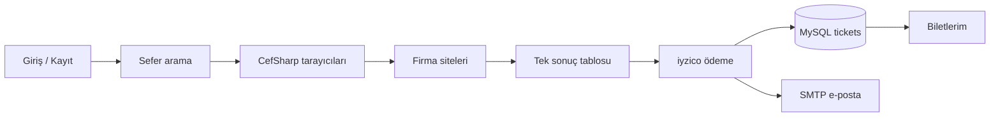

# OpenBilet

**Tek pencereden çoklu otobüs firması araması, iyzico ile ödeme ve e-posta bileti.**

Windows masaüstü uygulaması. Kalkış, varış ve tarihi seçtiğinizde arka planda gömülü Chromium (CefSharp) tarayıcıları yedi firmanın sitesini paralel tarar; sonuçları tek listede birleştirir. Satın alma iyzico sandbox üzerinden yapılır, bilet MySQL’e kaydedilir ve HTML e-posta olarak gönderilir.

<p>
  
  
  
  
  
</p>

---

## Özellikler

- **Kayıt ve giriş** — kullanıcı adı / şifre ile hesap; oturum kapatınca tekrar giriş ekranına döner
- **Aranabilir durak seçimi** — MySQL `stops` tablosundan şehir + durak, firma bazlı alias eşlemesi
- **Paralel sefer araması** — yedi firma aynı anda taranır; biri düşse diğerleri listelenmeye devam eder
- **Karşılaştırmalı sonuç tablosu** — firma, kalkış, varış, saat, fiyat, koltuk tipi, açıklama
- **iyzico ödeme** — kart bilgisi ve yolcu bilgisi; başarılı ödemede `tickets` kaydı
- **Biletlerim** — geçmiş bilet kartları, geçmiş seferler ayrı işaretlenir
- **HTML e-posta** — Gmail SMTP ile bilet onay maili
- **Test paneli** (geliştirme) — gömülü tarayıcıları ve arama logunu izleme

### Desteklenen firmalar

| Firma | Modül |
|---|---|
| Efetur | `Cefsharp/Efetur.cs` |
| Düzcegüven | `Cefsharp/Duzceguven.cs` |
| Metro | `Cefsharp/Metro.cs` |
| Pamukkale | `Cefsharp/Pamukkale.cs` |
| Lüxyalova | `Cefsharp/Luxyalova.cs` |
| Narlıca | `Cefsharp/Narlica.cs` |
| Ali Osman Ulusoy | `Cefsharp/AliOsmanUlusoy.cs` |

Firma URL’leri kodda sabit değil; `companies.scrape_url` alanından okunur.

---

## Nasıl çalışır



1. Kullanıcı giriş yapar (`users`).
2. Duraklar `stops` + `stop_aliases` üzerinden firmanın beklediği isme çevrilir.
3. Her firma için gizli bir Chromium paneli ilgili `scrape_url`’i açar ve JavaScript ile sefer çeker.
4. Sonuçlar birleşik grid’de gösterilir; **Satın Al** `OdemeForm`’u açar.
5. iyzico sandbox ödeme başarılıysa bilet kaydedilir ve e-posta gider.

> Firma sitelerinin HTML/JS yapısı değişirse ilgili `Cefsharp/*.cs` dosyasındaki seçiciler güncellenmelidir.

---

## Teknoloji

| Katman | Kullanılan |
|---|---|
| UI | Windows Forms, .NET Framework 4.8 |
| Tarayıcı | CefSharp.WinForms 145 |
| Veritabanı | MySQL (`MySql.Data`) |
| Ödeme | iyzico (`Iyzipay` 2.1.64, sandbox) |
| JSON | Newtonsoft.Json |
| E-posta | System.Net.Mail (Gmail SMTP, 587 / STARTTLS) |
| Yapılandırma | `App.config` → `AppSettings` |

---

## Gereksinimler

- Windows 10 veya 11 (x64 önerilir)
- [Visual Studio 2022](https://visualstudio.microsoft.com/) — **.NET desktop development** iş yükü
- .NET Framework 4.8 Developer Pack
- MySQL Server 8.x
- [NuGet](https://www.nuget.org/downloads) (VS içinden restore yeter)

CefSharp native Chromium runtime kullandığı için Linux / macOS hedefi yok.

---

## Kurulum

```bash
git clone https://github.com/KULLANICIADI/openbilet.git
cd openbilet
```

1. `App.config.example` dosyasını `App.config` olarak kopyalayın (zaten varsa sadece değerleri doldurun).
2. Aşağıdaki ayarları kendi ortamınıza göre doldurun.
3. Visual Studio’da `openbilet.sln` açın → **Restore NuGet Packages**  
   veya:

   ```bash
   nuget restore openbilet.sln
   ```

4. MySQL’de `openbilet` veritabanını ve tabloları oluşturun (şema aşağıda).
5. `F5` ile çalıştırın.

### App.config

| Anahtar | Açıklama |
|---|---|
| `connectionStrings / OpenBilet` | `Server`, `Database`, `Uid`, `Pwd` |
| `SmtpEmail` / `SmtpPassword` | Gmail adresi ve [uygulama şifresi](https://support.google.com/accounts/answer/185833) |
| `SmtpSenderName` | Gönderen görünür adı (varsayılan: OpenTicket) |
| `IyzicoApiKey` / `IyzicoSecretKey` | [iyzico sandbox](https://sandbox-merchant.iyzipay.com/) anahtarları |
| `IyzicoBaseUrl` | `https://sandbox-api.iyzipay.com` |

Gerçek şifre ve anahtarları commit etmeyin. `App.config` şablon olarak boş değerlerle durur; gizli bilgiler yalnızca sizin makinenizde kalmalıdır.

---

## Veritabanı

Uygulamanın beklediği minimum şema:

```sql
CREATE DATABASE IF NOT EXISTS openbilet
  CHARACTER SET utf8mb4 COLLATE utf8mb4_unicode_ci;
USE openbilet;

CREATE TABLE users (
  id INT AUTO_INCREMENT PRIMARY KEY,
  ad VARCHAR(80) NOT NULL,
  soyad VARCHAR(80) NOT NULL,
  email VARCHAR(120),
  telefon VARCHAR(30),
  kullanici_adi VARCHAR(80) NOT NULL UNIQUE,
  sifre VARCHAR(255) NOT NULL
);

CREATE TABLE companies (
  id INT AUTO_INCREMENT PRIMARY KEY,
  name VARCHAR(80) NOT NULL UNIQUE,
  scrape_url VARCHAR(500) NOT NULL
);

CREATE TABLE stops (
  id INT AUTO_INCREMENT PRIMARY KEY,
  city VARCHAR(80) NOT NULL,
  canonical_name VARCHAR(80) NOT NULL,
  is_active TINYINT(1) NOT NULL DEFAULT 1
);

CREATE TABLE stop_aliases (
  id INT AUTO_INCREMENT PRIMARY KEY,
  stop_id INT NOT NULL,
  alias_name VARCHAR(120) NOT NULL,
  company VARCHAR(80) NULL,
  FOREIGN KEY (stop_id) REFERENCES stops(id)
);

CREATE TABLE tickets (
  id INT AUTO_INCREMENT PRIMARY KEY,
  user_id INT NOT NULL,
  firma VARCHAR(80) NOT NULL,
  kalkis VARCHAR(120) NOT NULL,
  varis VARCHAR(120) NOT NULL,
  tarih DATE NOT NULL,
  saat VARCHAR(20) NOT NULL,
  fiyat VARCHAR(40) NOT NULL,
  koltuk_tipi VARCHAR(40),
  odeme_id VARCHAR(80),
  satin_alma_tarihi DATETIME NOT NULL DEFAULT CURRENT_TIMESTAMP,
  FOREIGN KEY (user_id) REFERENCES users(id)
);
```

`companies.name` değerleri kodla birebir eşleşmelidir:

```text
Efetur, Düzcegüven, Metro, Pamukkale, Lüxyalova, Narlıca, AliOsmanUlusoy
```

`stop_aliases.company` NULL ise tüm firmalar için geçerli alias kullanılır; doluysa yalnızca o firmaya özeldir.

---

## Proje yapısı

```text
openbilet/
├── Program.cs                 # CefSharp init, giriş döngüsü
├── AppSettings.cs             # App.config okuma
├── App.config.example         # Yapılandırma şablonu
├── LoginForm.cs               # Giriş / kayıt
├── Form1.cs                   # Ana arama ekranı
├── OdemeForm.cs               # Kart + yolcu + iyzico
├── BiletlerimForm.cs          # Satın alınan biletler
├── TestForm.cs                # Geliştirici tarayıcı / log paneli
├── SearchableComboBox.cs      # Durak arama kutusu
├── Models/SeferBilgisi.cs
├── Services/
│   ├── IyzicoService.cs
│   └── EmailService.cs
└── Cefsharp/
    ├── main.cs                # Ortak JS, durak çözümü, firma URL
    ├── Efetur.cs
    ├── Duzceguven.cs
    ├── Metro.cs
    ├── Pamukkale.cs
    ├── Luxyalova.cs
    ├── Narlica.cs
    └── AliOsmanUlusoy.cs
```

`bin/`, `obj/`, `.vs/` ve `packages/` git’e alınmaz. İlk derlemeden önce NuGet restore şarttır.

---

## Kullanım

1. Hesap oluşturun veya giriş yapın.
2. **Nereden / Nereye / Tarih** seçip **Ara**.
3. Listeden sefer seçin → **Satın Al**.
4. Kart ve yolcu bilgilerini doldurup ödemeyi tamamlayın.
5. **Biletlerim** ile geçmişi görüntüleyin.

Sandbox test kartları için iyzico dokümantasyonuna bakın: [Test kartları](https://docs.iyzico.com/odeme-yontemleri/kredi-karti/test-kartlari).

---

## Geliştirme notları

- Gömülü tarayıcı panelleri ekran dışında tutulur; **Test** butonu onları görünür yapar.
- GPU, CefSharp kararlılığı için `disable-gpu` ile kapatılır.
- Şifreler şu an düz metin saklanır; üretim için hash (ör. BCrypt) eklenmelidir.
- Firma sitelerine otomatik istek atmak, o sitelerin kullanım şartlarını ihlal edebilir. Bu repo eğitim / kişisel karşılaştırma içindir; ticari kullanım veya yoğun tarama için resmi API tercih edin.

---

## Lisans

Henüz bir lisans dosyası yok. Repoyu fork/kullanmadan önce proje sahibine sorun.
